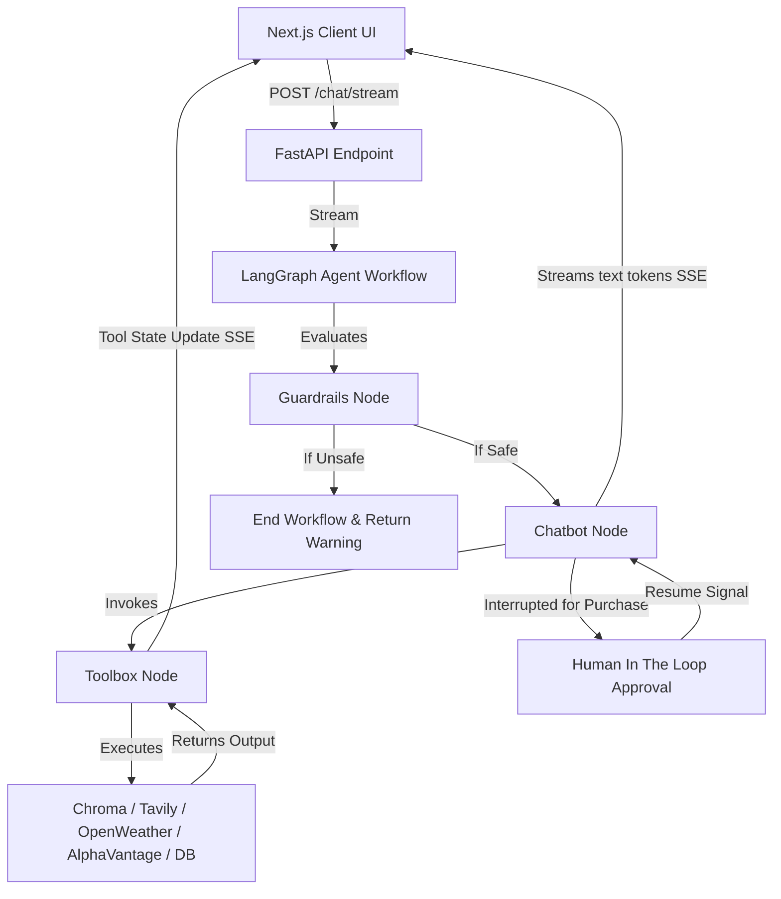

# Agentic Chat Bot

A state-of-the-art, feature-rich conversational assistant application built using a **Next.js (React) frontend** and a **FastAPI + LangGraph backend**. The bot dynamically utilizes an suite of tools, displays real-time execution flows, ingests documents in a ChatGPT-like interface, and maintains global long-term memory.

---

## 🌟 Key Features & Capabilities

### 1. Real-Time Tool Execution Transparency
*   **Live Trace Indicators**: The assistant bubbles display status tags tracking agent tool activations in real time.
*   **Progressive States**: Shows a spinning orange loader for `"running"` operations and a green checkmark/label once `"done"`.
*   **Data Security**: Keeps sensitive parameters and execution outputs secure by hiding detailed logs and arguments from the user interface.

### 2. File Upload & Automatic RAG Ingestion
*   **ChatGPT-like File Card**: When attaching a file, a dedicated status card displays name, size, type-specific coloring, and real-time ingestion feedback.
*   **Immediate Chunking**: Select files are immediately processed on the server, split into chunks, and vectorized via a persistent **Chroma** collection index.
*   **Inline Messages**: Files appear inside the chat bubble as read-only attachment cards.
*   **Supported Types**: `.pdf`, `.docx`, `.txt`, `.md`, `.py`, `.csv`.

### 3. Cross-Conversation Memory
*   **Global Recall**: Facts and preferences saved in one thread via `remember_this` are searched globally and can be recalled in any other conversation thread.
*   **Smart Query Matching**: Searches utilizing SQLite `LIKE` operator matching keywords, falling back to the 20 most recent general memories if no specific matches are found.

### 4. Interactive Toolset
*   🧮 **Calculator**: Parses and executes safe Python math expressions.
*   🔍 **Web Search**: Integrates **Tavily API** to browse advanced web results for up-to-date queries.
*   ☁️ **Weather check**: Connects to **OpenWeather API** (Geocoding + Weather reports) to check forecasts.
*   📈 **Stock Quote**: Retrieves real-time stock details from the **AlphaVantage API**.
*   🤝 **Stock Purchase (HITL)**: Utilizes LangGraph `interrupt` logic to pause the graph execution and request human confirmation/approval before finalizing stock trades.

### 5. Multi-Model Support
*   Supported models include:
    *   **Google Gemini**: `gemini-2.5-flash` (default), `gemini-2.5-pro`, `gemini-2.5-flash-lite`, `gemini-2.0-flash`, `gemini-2.0-flash-lite`
    *   **Mistral AI**: `mistral-small-latest`, `mistral-medium-latest`, `mistral-large-latest`
    *   **OpenAI**: `gpt-5.5`, `gpt-5.4-nano`, `gpt-5.4-thinking`
    *   **Groq**: `llama-3.3-70b-versatile`, `meta-llama/llama-4-scout-17b-16e-instruct`, `llama-3.1-8b-instant`

### 6. Custom API Keys (BYOK - Bring Your Own Keys)
*   **Client-Side Configuration**: Users can input custom API keys for **Google Gemini**, **OpenAI**, **Mistral**, or **Groq** via the settings modal.
*   **Main Page Entry Points**: Easily accessible via the key shortcut icon (🔑) next to the model selector dropdown in the chat input bar or the configuration notice banner on the welcome screen.
*   **Secure Storage & Override**: Keys are saved locally in the browser's `localStorage` and sent securely on every chat stream request, overriding the backend env-default keys when supplied.

### 7. Input Security Guardrails & Verification Benchmarks
*   **Inbound Guardrails Node**: Features a modular LangGraph guardrail checker node at the entry point of the state graph. Evaluates incoming user prompts against safety policies (hate speech, malicious exploits, prompt injections, and cyberattacks) using high-efficiency classification models.
*   **Automatic Interception**: Automatically blocks unsafe requests before executing downstream model requests or tools, responding with a secure warning dialog.
*   **Audit Benchmark Suite**: Includes a validation script under `backend/Test/test_guardrails.py` that audits the chatbot's alignment rate with security guidelines across multiple safety classes, reporting a 100% block success rate for harmful inputs.

---

## 🏗️ Architecture & Flow



### Backend (`/backend`)
*   **`main.py`**: Handles routers, uploads, and FastAPI Server-Sent Events (SSE).
*   **`Agent/chatbot.py`**: Compiles the LangGraph StateGraph, binds models and tools, and sets SQLite checkpoints.
*   **`Memory/database.py`**: Manages SQLite storage for thread histories, custom tool metrics, and global memory tables.
*   **`Utils/helpers.py`**: Processes SSE formatting, filters text tokens, and validates chunks before sending.

### Frontend (`/frontend`)
*   **`useChatStore.js`**: Core react store managing state for active threads, streaming status, selected models, and parsing SSE loops.
*   **`lib/api.js`**: Communication client wrapper.
*   **`components/`**: Modular elements (`FileCard.jsx`, `AttachmentCard.jsx`, `ToolCallsDisplay.jsx`) styled dynamically.

---

## 🛠️ Tool Specifications

| Tool | Trigger Command | Input | Behavior | External Dependency |
| :--- | :--- | :--- | :--- | :--- |
| **Calculator** | Mathematical equations | `expression: str` | Evaluates safe expressions using an allowlist of math functions | None |
| **Search** | Current affairs, facts | `query: str` | Queries up to 5 advanced search depth items | Tavily API Key |
| **Weather** | Location temperatures | `location: str` | Fetches lat/lon coordinates, then pulls current weather stats | OpenWeather API Key |
| **Stock Quote** | Stock prices | `symbol: str` | Queries AlphaVantage quote services | AlphaVantage API Key |
| **Stock Purchase** | Buying shares | `symbol: str, quantity: int` | Interrupts graph execution. Pauses until a user replies with "yes" or "no". | AlphaVantage API Key |
| **RAG Retrieval**| Querying uploaded files | `query: str` | Performs vector search on document index | Chroma DB |
| **Remember Memory**| User tells bot to remember | `memory: str` | Saves preferences/facts globally | SQLite DB |
| **Recall Memory** | Asking for facts/name | `query: str` | Searches memories with text matching and recent fallback | SQLite DB |

---

## 🚀 Getting Started

### 1. Setup Backend
1.  Navigate to `backend`:
    ```bash
    cd backend
    ```
2.  Set up environment keys in `.env`:
    ```env
    GEMINI_API_KEY=your_gemini_key
    TAVILY_API_KEY=your_tavily_key
    OPENWEATHER_API_KEY=your_openweather_key
    ALPHAVANTAGE_API_KEY=your_alphavantage_key
    ```
3.  Launch the FastAPI server:
    ```bash
    .venv/bin/python main.py
    ```

### 2. Setup Frontend
1.  Navigate to `frontend`:
    ```bash
    cd frontend
    ```
2.  Install packages:
    ```bash
    npm install
    ```
3.  Launch the Next.js app:
    ```bash
    npm run dev
    ```
4.  Open [http://localhost:3000](http://localhost:3000) to start chatting!
